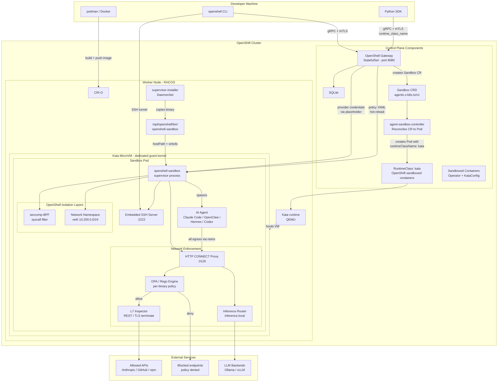

Run OpenShell sandboxes inside Kata Container VMs on OpenShift. Each sandbox pod runs in its own lightweight VM with a dedicated guest kernel, adding hardware-level isolation on top of OpenShell's seccomp, network namespace, and egress policy enforcement.

After completing this tutorial you will have:

- The OpenShift sandboxed containers operator installed with Kata enabled on all worker nodes.
- The OpenShell gateway deployed via Helm with the supervisor binary on every node.
- A custom sandbox image with your AI agent baked in.
- A running sandbox inside a Kata VM with network policy enforcement.

## Prerequisites

- An OpenShift cluster (4.14+) with `cluster-admin` access.
- Nodes with hardware virtualization support (Intel VT-x / AMD-V). Bare-metal or nested-virt enabled VMs.
- `oc` / `kubectl`, `helm` v3, and `podman` or Docker installed locally.
- OpenShell CLI installed. See the [Quickstart](/get-started/quickstart) if you have not installed it yet.

## Architecture

Three layers of isolation protect your infrastructure:

1. **Kata VM** -- each sandbox pod runs inside a QEMU microVM with its own guest kernel.
2. **OpenShell sandbox** -- inside the VM, the supervisor enforces seccomp-BPF syscall filters and a dedicated network namespace with veth pairs and iptables rules.
3. **Egress proxy and OPA** -- all outbound traffic passes through an HTTP CONNECT proxy that evaluates per-binary, per-endpoint network policy via an embedded OPA/Rego engine.



<Steps toc={true}>

## Install the Sandboxed Containers Operator

OpenShift uses the **sandboxed containers operator** from the Red Hat catalog instead of upstream `kata-deploy`. The operator installs Kata binaries via MachineConfig and reboots nodes one at a time.

Create the operator namespace, OperatorGroup, and Subscription:

```shell
oc create namespace openshift-sandboxed-containers-operator

oc apply -f - <<'EOF'
apiVersion: operators.coreos.com/v1
kind: OperatorGroup
metadata:
  name: sandboxed-containers-operator-group
  namespace: openshift-sandboxed-containers-operator
spec:
  targetNamespaces:
    - openshift-sandboxed-containers-operator
EOF

oc apply -f - <<'EOF'
apiVersion: operators.coreos.com/v1alpha1
kind: Subscription
metadata:
  name: sandboxed-containers-operator
  namespace: openshift-sandboxed-containers-operator
spec:
  channel: stable-1.3
  installPlanApproval: Automatic
  name: sandboxed-containers-operator
  source: redhat-operators
  sourceNamespace: openshift-marketplace
EOF
```

Wait for the operator CSV to reach `Succeeded`:

```shell
oc -n openshift-sandboxed-containers-operator get csv -w
```

Create the KataConfig CR to deploy Kata on all nodes:

```shell
oc apply -f - <<'EOF'
apiVersion: kataconfiguration.openshift.io/v1
kind: KataConfig
metadata:
  name: cluster-kataconfig
spec:
  kataConfigPoolSelector: null
EOF
```

This triggers a MachineConfig rollout that reboots each node one at a time. Monitor progress -- expect 5-8 minutes per node:

```shell
oc get mcp master -w
oc get kataconfig cluster-kataconfig \
  -o jsonpath='completed={.status.installationStatus.completed.completedNodesCount} total={.status.totalNodesCount}'
```

When all nodes are updated, verify the `kata` RuntimeClass exists:

```shell
oc get runtimeclass kata
```

Confirm Kata works with a test pod:

```shell
oc run kata-test --image=registry.access.redhat.com/ubi9/ubi-minimal:latest \
  --restart=Never \
  --overrides='{"spec":{"runtimeClassName":"kata"}}' \
  -- sh -c "echo 'Kata VM running'; uname -r"
oc wait --for=condition=Ready pod/kata-test --timeout=120s
oc logs kata-test
oc delete pod kata-test
```

The kernel version in the output is the Kata guest kernel, not the host RHCOS kernel.

## Deploy the Supervisor Binary

The Kubernetes driver side-loads the `openshell-sandbox` supervisor from `/opt/openshell/bin/openshell-sandbox` on the node via a hostPath volume. Deploy the installer DaemonSet:

```shell
oc create namespace openshell
```

On OpenShift, the init container that copies the binary to the host filesystem needs the `privileged` SCC because SELinux blocks writes to hostPath volumes. Create a dedicated service account and grant it the built-in `privileged` SCC:

```shell
oc -n openshell create serviceaccount openshell-supervisor-installer
oc adm policy add-scc-to-user privileged \
  -z openshell-supervisor-installer -n openshell
```

Deploy the DaemonSet, patch it to use the service account, and mark the init container as privileged:

```shell
oc apply -f examples/kata-containers/supervisor-daemonset.yaml

oc -n openshell patch daemonset openshell-supervisor-installer \
  -p '{"spec":{"template":{"spec":{"serviceAccountName":"openshell-supervisor-installer"}}}}'

oc -n openshell patch daemonset openshell-supervisor-installer --type=json \
  -p '[{"op":"add","path":"/spec/template/spec/initContainers/0/securityContext","value":{"privileged":true}}]'
```

Wait for rollout:

```shell
oc -n openshell rollout status daemonset/openshell-supervisor-installer
```

Relabel the binary on every node so SELinux allows containers to execute it:

```shell
for node in $(oc get nodes -o jsonpath='{.items[*].metadata.name}'); do
  oc debug node/$node -- chroot /host \
    chcon -t container_file_t /opt/openshell/bin/openshell-sandbox
done
```

## Deploy the Agent-Sandbox CRD

Install the Sandbox Custom Resource Definition and its controller:

```shell
oc apply -f https://raw.githubusercontent.com/NVIDIA/OpenShell/main/deploy/kube/manifests/agent-sandbox.yaml
oc get crd sandboxes.agents.x-k8s.io
oc -n agent-sandbox-system get pods
```

## Install cert-manager

The gateway requires mTLS certificates. Use cert-manager to issue and rotate them automatically.

```shell
oc apply -f https://github.com/cert-manager/cert-manager/releases/latest/download/cert-manager.yaml
oc -n cert-manager wait --for=condition=Ready pod --all --timeout=120s
```

## Create Certificates

Create a self-signed CA, an Issuer backed by that CA, and then the server and client Certificates:

```shell
oc apply -f - <<'EOF'
apiVersion: cert-manager.io/v1
kind: ClusterIssuer
metadata:
  name: openshell-selfsigned
spec:
  selfSigned: {}
---
apiVersion: cert-manager.io/v1
kind: Certificate
metadata:
  name: openshell-ca
  namespace: openshell
spec:
  isCA: true
  commonName: openshell-ca
  secretName: openshell-ca-keypair
  duration: 8760h
  privateKey:
    algorithm: ECDSA
    size: 256
  issuerRef:
    name: openshell-selfsigned
    kind: ClusterIssuer
    group: cert-manager.io
---
apiVersion: cert-manager.io/v1
kind: Issuer
metadata:
  name: openshell-ca-issuer
  namespace: openshell
spec:
  ca:
    secretName: openshell-ca-keypair
EOF

oc -n openshell wait --for=condition=Ready certificate/openshell-ca --timeout=60s
```

Issue the server certificate (gateway) and client certificate (sandbox pods):

```shell
oc apply -f - <<'EOF'
apiVersion: cert-manager.io/v1
kind: Certificate
metadata:
  name: openshell-server
  namespace: openshell
spec:
  secretName: openshell-server-tls
  duration: 8760h
  commonName: openshell
  dnsNames:
    - openshell
    - openshell.openshell.svc
    - openshell.openshell.svc.cluster.local
    - localhost
  ipAddresses:
    - 127.0.0.1
    - <NODE_IP>
  usages:
    - server auth
    - digital signature
    - key encipherment
  privateKey:
    algorithm: ECDSA
    size: 256
  issuerRef:
    name: openshell-ca-issuer
    kind: Issuer
    group: cert-manager.io
---
apiVersion: cert-manager.io/v1
kind: Certificate
metadata:
  name: openshell-client
  namespace: openshell
spec:
  secretName: openshell-client-tls
  duration: 8760h
  commonName: openshell-client
  usages:
    - client auth
    - digital signature
    - key encipherment
  privateKey:
    algorithm: ECDSA
    size: 256
  issuerRef:
    name: openshell-ca-issuer
    kind: Issuer
    group: cert-manager.io
EOF

oc -n openshell wait --for=condition=Ready certificate/openshell-server --timeout=60s
oc -n openshell wait --for=condition=Ready certificate/openshell-client --timeout=60s
```

Create the client CA secret (the gateway needs the CA cert to verify client certificates) and the SSH handshake secret:

```shell
CA_CRT=$(oc -n openshell get secret openshell-ca-keypair -o jsonpath='{.data.ca\.crt}')
oc -n openshell create secret generic openshell-server-client-ca \
  --from-literal=ca.crt="$(echo "$CA_CRT" | base64 -d)"

oc -n openshell create secret generic openshell-ssh-handshake \
  --from-literal=secret=$(openssl rand -hex 32)
```

Verify all secrets exist:

```shell
oc -n openshell get certificate
oc -n openshell get secrets | grep openshell
```

## Create the Sandbox SCC

Sandbox pods require Linux capabilities (`SYS_ADMIN`, `NET_ADMIN`, `SYS_PTRACE`, `SYSLOG`) and must run as root for the supervisor to set up network namespaces and Landlock enforcement. Create a dedicated SCC:

```shell
oc apply -f - <<'EOF'
apiVersion: security.openshift.io/v1
kind: SecurityContextConstraints
metadata:
  name: openshell-sandbox
allowHostDirVolumePlugin: true
allowHostNetwork: false
allowHostPID: false
allowHostPorts: false
allowPrivilegedContainer: true
allowedCapabilities:
  - SYS_ADMIN
  - NET_ADMIN
  - SYS_PTRACE
  - SYSLOG
readOnlyRootFilesystem: false
runAsUser:
  type: RunAsAny
seLinuxContext:
  type: MustRunAs
  seLinuxOptions:
    type: spc_t
fsGroup:
  type: RunAsAny
supplementalGroups:
  type: RunAsAny
volumes:
  - hostPath
  - emptyDir
  - projected
  - secret
  - configMap
  - persistentVolumeClaim
EOF
```

Bind the SCC to the default service account in the sandbox namespace (the gateway creates sandbox pods using this account):

```shell
oc adm policy add-scc-to-user openshell-sandbox \
  -z default -n openshell
```

## Grant the Gateway SCC

The gateway pod runs as uid 1000 with `fsGroup: 1000`. Grant the `anyuid` SCC to the Helm-created service account so OpenShift admits it:

```shell
oc adm policy add-scc-to-user anyuid -z openshell -n openshell
```

## Mirror Images (Air-Gapped Clusters)

If your cluster nodes cannot pull from `ghcr.io`, enable the internal registry and mirror the images. Skip this step if your nodes have direct internet access.

Enable the OpenShift internal registry:

```shell
oc patch configs.imageregistry.operator.openshift.io cluster \
  --type merge -p '{"spec":{"managementState":"Managed","storage":{"emptyDir":{}},"defaultRoute":true}}'
oc -n openshift-image-registry wait --for=condition=Ready pod -l docker-registry=default --timeout=120s
```

Create a push token and port-forward to the registry:

```shell
oc apply -f - <<'EOF'
apiVersion: v1
kind: Secret
metadata:
  name: builder-token
  namespace: openshell
  annotations:
    kubernetes.io/service-account.name: builder
type: kubernetes.io/service-account-token
EOF

oc policy add-role-to-user system:image-pusher \
  system:serviceaccount:openshell:builder -n openshell

sleep 3
TOKEN=$(oc -n openshell get secret builder-token -o jsonpath='{.data.token}' | base64 -d)
oc -n openshift-image-registry port-forward svc/image-registry 5000:5000 &
sleep 3
```

Mirror the gateway and sandbox images (amd64) using `skopeo`:

```shell
skopeo copy --override-arch amd64 --override-os linux \
  --dest-tls-verify=false --dest-creds="unused:$TOKEN" \
  docker://ghcr.io/nvidia/openshell/gateway:0.0.30 \
  docker://localhost:5000/openshell/gateway:0.0.30

skopeo copy --override-arch amd64 --override-os linux \
  --dest-tls-verify=false --dest-creds="unused:$TOKEN" \
  docker://ghcr.io/nvidia/openshell-community/sandboxes/base:latest \
  docker://localhost:5000/openshell/sandboxes-base:latest

kill %1
```

<Note>
Use `--override-arch amd64` to ensure the correct platform is copied. Without it, `skopeo` may select the host platform (e.g. arm64 on Apple Silicon).
</Note>

Set the internal image references for the Helm install:

```shell
GATEWAY_IMAGE=image-registry.openshift-image-registry.svc:5000/openshell/gateway
SANDBOX_IMAGE=image-registry.openshift-image-registry.svc:5000/openshell/sandboxes-base:latest
```

If your cluster can pull from `ghcr.io` directly, use the defaults:

```shell
GATEWAY_IMAGE=ghcr.io/nvidia/openshell/gateway
SANDBOX_IMAGE=ghcr.io/nvidia/openshell-community/sandboxes/base:latest
```

## Install the Gateway via Helm

Determine a node IP for the SSH gateway host:

```shell
NODE_IP=$(oc get nodes -o jsonpath='{.items[0].status.addresses[?(@.type=="InternalIP")].address}')
echo "Using node IP: $NODE_IP"
```

Install via Helm:

```shell
helm install openshell deploy/helm/openshell/ \
  --namespace openshell \
  --set image.repository=$GATEWAY_IMAGE \
  --set image.tag=0.0.30 \
  --set server.sandboxNamespace=openshell \
  --set server.sandboxImage=$SANDBOX_IMAGE \
  --set server.grpcEndpoint=https://openshell.openshell.svc.cluster.local:8080 \
  --set server.sshGatewayHost=$NODE_IP \
  --set server.sshGatewayPort=30051
```

Wait for the gateway:

```shell
oc -n openshell rollout status statefulset/openshell --timeout=300s
```

Register it with the CLI and export the mTLS certificates so the CLI can authenticate:

```shell
openshell gateway add --name ocp-kata https://$NODE_IP:30051

GATEWAY_DIR=~/.config/openshell/gateways/ocp-kata/mtls
mkdir -p "$GATEWAY_DIR"

oc -n openshell get secret openshell-ca-keypair \
  -o jsonpath='{.data.ca\.crt}' | base64 -d > "$GATEWAY_DIR/ca.crt"
oc -n openshell get secret openshell-client-tls \
  -o jsonpath='{.data.tls\.crt}' | base64 -d > "$GATEWAY_DIR/tls.crt"
oc -n openshell get secret openshell-client-tls \
  -o jsonpath='{.data.tls\.key}' | base64 -d > "$GATEWAY_DIR/tls.key"
```

Verify connectivity:

```shell
openshell status
```

## Build a Sandbox Image

Your image provides the agent and its dependencies. OpenShell replaces the entrypoint at runtime with its supervisor. Key requirements:

- Standard Linux base image (not distroless or `FROM scratch`).
- `iproute2` installed (required for network namespace isolation).
- `iptables` installed (recommended for bypass detection).
- A `sandbox` user with uid/gid 1000.

Example for Claude Code (see [Dockerfile.claude-code](https://github.com/NVIDIA/OpenShell/blob/main/examples/kata-containers/Dockerfile.claude-code)):

```dockerfile
FROM node:22-slim

RUN apt-get update && apt-get install -y --no-install-recommends \
        curl iproute2 iptables git openssh-client ca-certificates \
    && rm -rf /var/lib/apt/lists/*

RUN npm install -g @anthropic-ai/claude-code

RUN groupadd -g 1000 sandbox && \
    useradd -m -u 1000 -g sandbox -s /bin/bash sandbox

WORKDIR /sandbox
```

Build and push to a registry your cluster can reach:

```shell
podman build -t myregistry.com/claude-sandbox:latest \
  -f examples/kata-containers/Dockerfile.claude-code .
podman push myregistry.com/claude-sandbox:latest
```

## Configure a Provider

Providers inject API keys into sandboxes. Create one from your local environment:

```shell
export ANTHROPIC_API_KEY=sk-ant-...
openshell provider create --name claude --type claude --from-existing
openshell provider list
```

## Create a Sandbox with Kata

The `runtime_class_name` field is fully supported in the gRPC API and Kubernetes driver but is not yet exposed as a CLI flag. Use the Python SDK script from the example:

```shell
uv run examples/kata-containers/create-kata-sandbox.py \
  --name my-claude \
  --image myregistry.com/claude-sandbox:latest \
  --runtime-class kata \
  --provider claude
```

Or create via CLI and patch afterward:

```shell
openshell sandbox create --name my-claude \
  --from myregistry.com/claude-sandbox:latest \
  --provider claude \
  --policy examples/kata-containers/policy-claude-code.yaml

oc -n openshell patch sandbox my-claude --type=merge -p '{
  "spec": {
    "podTemplate": {
      "spec": {
        "runtimeClassName": "kata"
      }
    }
  }
}'
```

<Note>
On OpenShift, the RuntimeClass name is `kata` (created by the sandboxed containers operator), not `kata-containers` as used in upstream Kata deployments.
</Note>

## Apply a Network Policy

Apply the Claude Code policy that allows Anthropic, GitHub, npm, and PyPI:

```shell
openshell policy set my-claude \
  --policy examples/kata-containers/policy-claude-code.yaml \
  --wait
```

Verify:

```shell
openshell policy get my-claude --full
```

## Connect and Run Your Agent

```shell
openshell sandbox connect my-claude
```

Inside the sandbox, start Claude Code:

```shell
claude
```

## Verify Kata Isolation

Confirm the pod is running with the Kata runtime:

```shell
oc -n openshell get pods -l sandbox=my-claude \
  -o jsonpath='{.items[0].spec.runtimeClassName}'
```

The output should be `kata`.

Check the guest kernel version (it should differ from the host):

```shell
openshell sandbox exec my-claude -- uname -r
```

Verify OpenShell sandbox isolation inside the VM:

```shell
openshell sandbox exec my-claude -- ip netns list
openshell sandbox exec my-claude -- ss -tlnp | grep 3128
openshell sandbox exec my-claude -- touch /usr/test-file
```

The network namespace should be listed, the proxy should be listening on port 3128, and writing to `/usr` should fail with "Permission denied".

</Steps>

## OpenShift-Specific Considerations

### Landlock on RHCOS Kernels

RHCOS ships kernel 5.14.x which predates Landlock ABI V2 (requires 5.19+). The supervisor falls back to seccomp-BPF and network namespace enforcement only. Filesystem isolation via Landlock is not available until RHCOS ships a newer kernel. To suppress warnings, set `landlock.compatibility: best_effort` in your policy YAML.

### Security Context Constraints

OpenShift enforces SCCs rather than PodSecurityPolicies. Sandbox pods need `SYS_ADMIN`, `NET_ADMIN`, `SYS_PTRACE`, and `SYSLOG` capabilities plus `runAsUser: 0`. The `openshell-sandbox` SCC created in this tutorial grants these permissions scoped to the `openshell` namespace's default service account. The supervisor installer DaemonSet has a separate, narrower SCC for hostPath access only.

### Guest Kernel Requirements

The Kata guest kernel used by the OpenShift sandboxed containers operator is based on the RHCOS host kernel. Verify kernel capabilities inside the VM:

```shell
oc run kata-check --image=registry.access.redhat.com/ubi9/ubi-minimal:latest \
  --restart=Never --overrides='{"spec":{"runtimeClassName":"kata"}}' \
  -- sh -c "uname -r; cat /proc/sys/kernel/seccomp/actions_avail 2>/dev/null; echo done"
oc logs kata-check
oc delete pod kata-check
```

### hostPath Volume Passthrough

The supervisor binary is injected via a hostPath volume. Kata passes hostPath volumes into the VM via virtiofs. The sandboxed containers operator configures this by default. If you have customized Kata's `configuration.toml`, ensure `/opt/openshell/bin` is allowed.

### Container Capabilities in Kata VMs

The OpenShell K8s driver automatically requests `SYS_ADMIN`, `NET_ADMIN`, `SYS_PTRACE`, and `SYSLOG`. Inside a Kata VM these capabilities are scoped to the guest kernel, not the host. The SCC grants them at the OpenShift admission layer.

### Performance

Kata adds 2-5 seconds of VM boot time. Runtime overhead is minimal for IO-bound AI agent workloads. Account for the base VM memory overhead (128-256 MB) in pod resource requests.

## Cleanup

```shell
openshell sandbox delete my-claude
openshell provider delete claude
oc delete -f examples/kata-containers/supervisor-daemonset.yaml
helm uninstall openshell -n openshell
oc delete -f https://raw.githubusercontent.com/NVIDIA/OpenShell/main/deploy/kube/manifests/agent-sandbox.yaml
oc adm policy remove-scc-from-user openshell-sandbox -z default -n openshell
oc delete scc openshell-sandbox openshell-supervisor-installer
oc delete namespace openshell
oc delete kataconfig cluster-kataconfig
```

Removing the KataConfig triggers a MachineConfig rollout that removes Kata binaries and reboots each node.

## Next Steps

- Explore the [example policies](https://github.com/NVIDIA/OpenShell/tree/main/examples/kata-containers) for minimal, L7, and full agent configurations.
- Add more providers for multi-agent setups. See [Manage Providers](/sandboxes/manage-providers).
- Configure [Inference Routing](/inference/about) to route model requests through local or remote LLM backends.
- Review the [Policy Schema Reference](/reference/policy-schema) for the full YAML specification.
