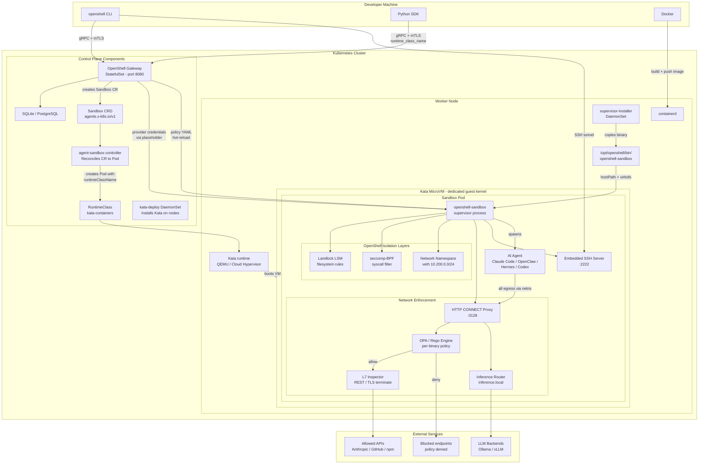

Run OpenShell sandboxes inside Kata Container VMs on Kubernetes. Each sandbox pod runs in its own lightweight VM with a dedicated guest kernel, adding hardware-level isolation on top of OpenShell's Landlock, seccomp, and network namespace enforcement.

After completing this tutorial you will have:

- Kata Containers installed and verified on your Kubernetes cluster.
- The OpenShell gateway deployed via Helm with the supervisor binary on every node.
- A custom sandbox image with your AI agent baked in.
- A running sandbox inside a Kata VM with network policy enforcement.

## Prerequisites

- A Kubernetes cluster (v1.26+) with admin access.
- Nodes with hardware virtualization support (Intel VT-x / AMD-V).
- `kubectl`, `helm` v3, and Docker installed locally.
- OpenShell CLI installed. See the [Quickstart](/get-started/quickstart) if you have not installed it yet.

## Architecture

Three layers of isolation protect your infrastructure:

1. **Kata VM** -- each sandbox pod runs inside a QEMU or Cloud Hypervisor microVM with its own guest kernel.
2. **OpenShell sandbox** -- inside the VM, the supervisor enforces Landlock filesystem rules, seccomp-BPF syscall filters, and a dedicated network namespace.
3. **Egress proxy and OPA** -- all outbound traffic passes through an HTTP CONNECT proxy that evaluates per-binary, per-endpoint network policy via an embedded OPA/Rego engine.



<Steps toc={true}>

## Install Kata Containers

kata-deploy is a DaemonSet that installs Kata binaries and configures containerd on every node.

```shell
kubectl apply -f https://raw.githubusercontent.com/kata-containers/kata-containers/main/tools/packaging/kata-deploy/kata-rbac/base/kata-rbac.yaml
kubectl apply -f https://raw.githubusercontent.com/kata-containers/kata-containers/main/tools/packaging/kata-deploy/kata-deploy/base/kata-deploy.yaml
kubectl -n kube-system wait --for=condition=Ready pod -l name=kata-deploy --timeout=600s
```

Verify the RuntimeClass exists:

```shell
kubectl get runtimeclass
```

If `kata-containers` is not listed, create it manually. An example manifest is at [examples/kata-containers/kata-runtimeclass.yaml](https://github.com/NVIDIA/OpenShell/blob/main/examples/kata-containers/kata-runtimeclass.yaml):

```shell
kubectl apply -f examples/kata-containers/kata-runtimeclass.yaml
```

Confirm Kata works by running a test pod:

```shell
kubectl run kata-test --image=busybox --restart=Never \
  --overrides='{"spec":{"runtimeClassName":"kata-containers"}}' \
  -- uname -a
kubectl wait --for=condition=Ready pod/kata-test --timeout=60s
kubectl logs kata-test
kubectl delete pod kata-test
```

If the kernel version differs from your host, Kata is working.

## Deploy the Supervisor Binary

The Kubernetes driver side-loads the `openshell-sandbox` supervisor from `/opt/openshell/bin/openshell-sandbox` on the node via a hostPath volume. For the built-in k3s cluster this is already present. For your own cluster, deploy the installer DaemonSet:

```shell
kubectl create namespace openshell
kubectl apply -f examples/kata-containers/supervisor-daemonset.yaml
```

Wait for it to roll out:

```shell
kubectl -n openshell rollout status daemonset/openshell-supervisor-installer
```

## Deploy the Agent-Sandbox CRD

Install the Sandbox Custom Resource Definition and its controller:

```shell
kubectl apply -f https://raw.githubusercontent.com/NVIDIA/OpenShell/main/deploy/kube/manifests/agent-sandbox.yaml
kubectl get crd sandboxes.agents.x-k8s.io
kubectl -n agent-sandbox-system get pods
```

## Create Secrets

The gateway requires mTLS certificates and an SSH handshake secret. The simplest approach is to bootstrap a local gateway, extract the PKI material, then create Kubernetes secrets:

```shell
openshell gateway start
GATEWAY_DIR=$(ls -d ~/.config/openshell/gateways/*/mtls | head -1)

kubectl -n openshell create secret tls openshell-server-tls \
  --cert="$GATEWAY_DIR/../server.crt" \
  --key="$GATEWAY_DIR/../server.key"

kubectl -n openshell create secret generic openshell-server-client-ca \
  --from-file=ca.crt="$GATEWAY_DIR/ca.crt"

kubectl -n openshell create secret tls openshell-client-tls \
  --cert="$GATEWAY_DIR/client.crt" \
  --key="$GATEWAY_DIR/client.key"

kubectl -n openshell create secret generic openshell-ssh-handshake \
  --from-literal=secret=$(openssl rand -hex 32)

openshell gateway stop
```

## Install the Gateway via Helm

```shell
helm install openshell deploy/helm/openshell/ \
  --namespace openshell \
  --set server.sandboxNamespace=openshell \
  --set server.sandboxImage=ghcr.io/nvidia/openshell-community/sandboxes/base:latest \
  --set server.grpcEndpoint=https://openshell.openshell.svc.cluster.local:8080 \
  --set server.sshGatewayHost=<YOUR_EXTERNAL_HOST> \
  --set server.sshGatewayPort=30051
```

Replace `<YOUR_EXTERNAL_HOST>` with the externally reachable address of your cluster's NodePort or load balancer.

Wait for the gateway:

```shell
kubectl -n openshell rollout status statefulset/openshell --timeout=300s
```

Register it with the CLI:

```shell
openshell gateway add --name kata-cluster --endpoint https://<YOUR_EXTERNAL_HOST>:30051
```

## Build a Sandbox Image

Your image provides the agent and its dependencies. OpenShell replaces the entrypoint at runtime with its supervisor, so pass the agent start command after `--` on the CLI. Key requirements:

- Standard Linux base image (not distroless or `FROM scratch`).
- `iproute2` installed (required for network namespace isolation).
- `iptables` installed (recommended for bypass detection).
- A `sandbox` user with uid/gid 1000.

Example for Claude Code (see [Dockerfile.claude-code](https://github.com/NVIDIA/OpenShell/blob/main/examples/kata-containers/Dockerfile.claude-code)):

```dockerfile
FROM node:22-slim

RUN apt-get update && apt-get install -y --no-install-recommends \
        curl iproute2 iptables git openssh-client ca-certificates \
    && rm -rf /var/lib/apt/lists/*

RUN npm install -g @anthropic-ai/claude-code

RUN groupadd -g 1000 sandbox && \
    useradd -m -u 1000 -g sandbox -s /bin/bash sandbox

WORKDIR /sandbox
```

Build and push to a registry your cluster can reach:

```shell
docker build -t myregistry.com/claude-sandbox:latest \
  -f examples/kata-containers/Dockerfile.claude-code .
docker push myregistry.com/claude-sandbox:latest
```

## Configure a Provider

Providers inject API keys into sandboxes. Create one from your local environment:

```shell
export ANTHROPIC_API_KEY=sk-ant-...
openshell provider create --name claude --type claude --from-existing
openshell provider list
```

## Create a Sandbox with Kata

The `runtime_class_name` field is fully supported in the gRPC API and Kubernetes driver but is not yet exposed as a CLI flag. Use the Python SDK script from the example:

```shell
uv run examples/kata-containers/create-kata-sandbox.py \
  --name my-claude \
  --image myregistry.com/claude-sandbox:latest \
  --runtime-class kata-containers \
  --provider claude
```

Or create via CLI and patch afterward:

```shell
openshell sandbox create --name my-claude \
  --from myregistry.com/claude-sandbox:latest \
  --provider claude \
  --policy examples/kata-containers/policy-claude-code.yaml

kubectl -n openshell patch sandbox my-claude --type=merge -p '{
  "spec": {
    "podTemplate": {
      "spec": {
        "runtimeClassName": "kata-containers"
      }
    }
  }
}'
```

## Apply a Network Policy

Apply the Claude Code policy that allows Anthropic, GitHub, npm, and PyPI:

```shell
openshell policy set my-claude \
  --policy examples/kata-containers/policy-claude-code.yaml \
  --wait
```

Verify:

```shell
openshell policy get my-claude --full
```

## Connect and Run Your Agent

```shell
openshell sandbox connect my-claude
```

Inside the sandbox, start Claude Code:

```shell
claude
```

## Verify Kata Isolation

Confirm the pod is running with the Kata runtime:

```shell
kubectl -n openshell get pods -l sandbox=my-claude \
  -o jsonpath='{.items[0].spec.runtimeClassName}'
```

The output should be `kata-containers`.

Check the guest kernel version (it should differ from the host):

```shell
openshell sandbox exec my-claude -- uname -r
```

Verify OpenShell sandbox isolation inside the VM:

```shell
openshell sandbox exec my-claude -- ip netns list
openshell sandbox exec my-claude -- ss -tlnp | grep 3128
openshell sandbox exec my-claude -- touch /usr/test-file
```

The network namespace should be listed, the proxy should be listening on port 3128, and writing to `/usr` should fail with "Permission denied".

</Steps>

## Kata-Specific Considerations

### Guest Kernel Requirements

The supervisor requires Landlock (ABI V2, kernel 5.19+), seccomp-BPF, network namespaces, veth, and iptables inside the VM. Most Kata guest kernels 5.15+ include these. If Landlock is unavailable, set `landlock.compatibility: best_effort` in the policy.

### hostPath Volume Passthrough

The supervisor binary is injected via a hostPath volume. Kata passes hostPath volumes into the VM via virtiofs or 9p. This works with standard Kata configurations. If your setup restricts host filesystem access, allow `/opt/openshell/bin` in the Kata `configuration.toml`.

### Container Capabilities

The OpenShell K8s driver automatically requests `SYS_ADMIN`, `NET_ADMIN`, `SYS_PTRACE`, and `SYSLOG`. Inside a Kata VM these capabilities are scoped to the guest kernel, not the host.

### Performance

Kata adds 2-5 seconds of VM boot time. Runtime overhead is minimal for IO-bound AI agent workloads. Account for the base VM memory overhead (128-256 MB) in pod resource requests.

## Cleanup

```shell
openshell sandbox delete my-claude
openshell provider delete claude
kubectl delete -f examples/kata-containers/supervisor-daemonset.yaml
helm uninstall openshell -n openshell
kubectl delete -f https://raw.githubusercontent.com/NVIDIA/OpenShell/main/deploy/kube/manifests/agent-sandbox.yaml
kubectl delete namespace openshell
```

## Next Steps

- Explore the [example policies](https://github.com/NVIDIA/OpenShell/tree/main/examples/kata-containers) for minimal, L7, and full agent configurations.
- Add more providers for multi-agent setups. See [Manage Providers](/sandboxes/manage-providers).
- Configure [Inference Routing](/inference/about) to route model requests through local or remote LLM backends.
- Review the [Policy Schema Reference](/reference/policy-schema) for the full YAML specification.
