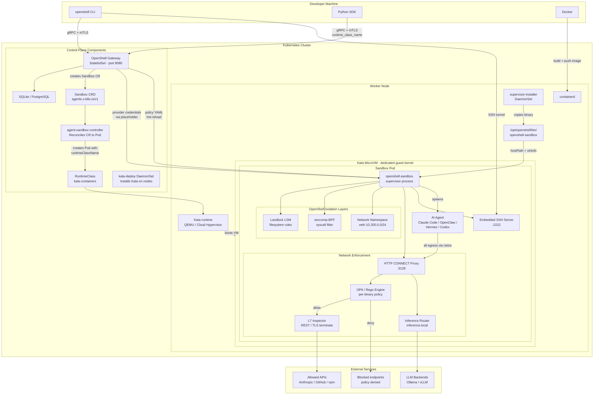

# Running AI Agents with Kata Containers

Run OpenShell sandboxes inside Kata Container VMs for hardware-level
isolation on Kubernetes.  This example covers Kata setup, custom sandbox
images, policy authoring, and sandbox creation with `runtimeClassName`.

## Architecture



Three layers of isolation protect your infrastructure:

1. **Kata VM** -- each sandbox pod runs inside its own QEMU/Cloud Hypervisor
   microVM with a dedicated guest kernel, providing hardware-level isolation.
2. **OpenShell sandbox** -- inside the VM, the supervisor enforces Landlock
   filesystem rules, seccomp-BPF syscall filters, and a dedicated network
   namespace.
3. **Egress proxy and OPA** -- all outbound traffic passes through an HTTP
   CONNECT proxy that evaluates per-binary, per-endpoint network policy via
   an embedded OPA/Rego engine.

## Prerequisites

- A Kubernetes cluster (v1.26+) with admin access
- Nodes with hardware virtualization (Intel VT-x / AMD-V)
- `kubectl`, `helm` v3, and Docker on your local machine
- OpenShell CLI installed (`curl -LsSf https://raw.githubusercontent.com/NVIDIA/OpenShell/main/install.sh | sh`)

## What's in this example

| File                          | Description                                                        |
| ----------------------------- | ------------------------------------------------------------------ |
| `Dockerfile.claude-code`      | Sandbox image for Claude Code (Node.js base)                       |
| `Dockerfile.python-agent`     | Sandbox image for Python-based agents (Hermes, custom)             |
| `policy-claude-code.yaml`     | Network policy: Anthropic API, GitHub, npm, PyPI                   |
| `policy-minimal.yaml`         | Minimal policy: single API endpoint                                |
| `policy-l7-github.yaml`       | L7 read-only policy for the GitHub REST API                        |
| `supervisor-daemonset.yaml`   | DaemonSet that installs the supervisor binary on every node        |
| `create-kata-sandbox.py`      | Python SDK script to create a sandbox with Kata runtime class      |
| `kata-runtimeclass.yaml`      | RuntimeClass manifest for Kata                                     |

## Quick start

### 1. Install Kata Containers on your cluster

```bash
kubectl apply -f https://raw.githubusercontent.com/kata-containers/kata-containers/main/tools/packaging/kata-deploy/kata-rbac/base/kata-rbac.yaml
kubectl apply -f https://raw.githubusercontent.com/kata-containers/kata-containers/main/tools/packaging/kata-deploy/kata-deploy/base/kata-deploy.yaml
kubectl -n kube-system wait --for=condition=Ready pod -l name=kata-deploy --timeout=600s
```

Verify the RuntimeClass exists:

```bash
kubectl get runtimeclass
```

If `kata-containers` is missing:

```bash
kubectl apply -f examples/kata-containers/kata-runtimeclass.yaml
```

### 2. Deploy the supervisor binary to nodes

```bash
kubectl apply -f examples/kata-containers/supervisor-daemonset.yaml
```

### 3. Deploy the OpenShell gateway

Follow the [Kata Containers tutorial](../../docs/tutorials/kata-containers.mdx)
for full Helm-based gateway deployment, or use the built-in local gateway:

```bash
openshell gateway start
```

### 4. Create a provider

```bash
export ANTHROPIC_API_KEY=sk-ant-...
openshell provider create --name claude --type claude --from-existing
```

### 5. Create a Kata-isolated sandbox

Using the Python SDK (the CLI does not yet expose `--runtime-class`):

```bash
uv run examples/kata-containers/create-kata-sandbox.py \
  --name my-claude \
  --image myregistry.com/claude-sandbox:latest \
  --provider claude \
  --runtime-class kata-containers
```

Or create via CLI without Kata and patch afterward:

```bash
openshell sandbox create --name my-claude \
  --from examples/kata-containers/Dockerfile.claude-code \
  --provider claude \
  --policy examples/kata-containers/policy-claude-code.yaml

kubectl -n openshell patch sandbox my-claude --type=merge -p '{
  "spec": {
    "podTemplate": {
      "spec": {
        "runtimeClassName": "kata-containers"
      }
    }
  }
}'
```

### 6. Connect and run your agent

```bash
openshell sandbox connect my-claude
# Inside the sandbox:
claude
```

### 7. Verify Kata isolation

```bash
# Guest kernel (should differ from host)
openshell sandbox exec my-claude -- uname -r

# Sandbox network namespace
openshell sandbox exec my-claude -- ip netns list

# Proxy is running
openshell sandbox exec my-claude -- ss -tlnp | grep 3128
```

## Cleanup

```bash
openshell sandbox delete my-claude
openshell provider delete claude
kubectl delete -f examples/kata-containers/supervisor-daemonset.yaml
```
